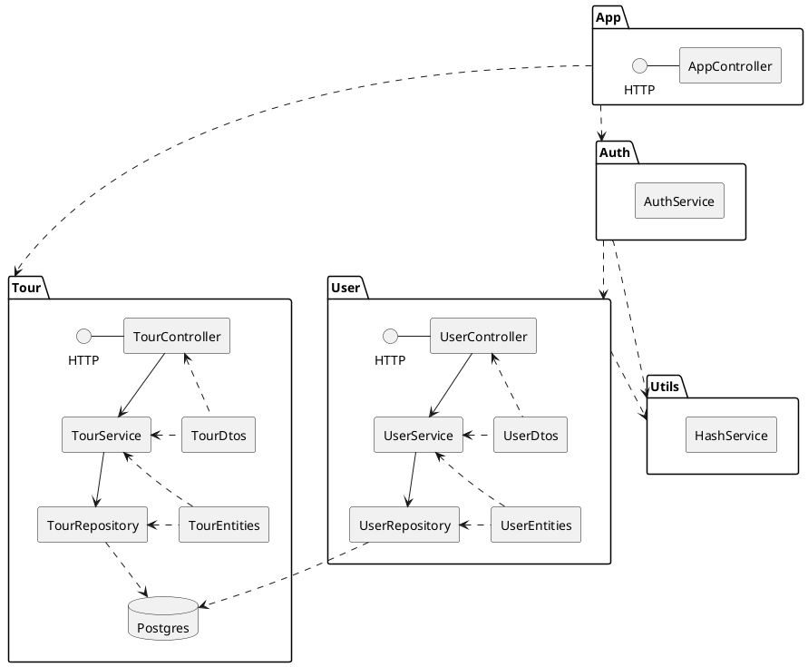

We are using the out-of-the-box architecture provided by NestJS which consists of a modular approach. Each domain gets
its own feature module which can then be imported by other modules (by default modules are singletons and thus can be
shared). Each NestJS application has at least one root module which is the starting point for NestJS to build the
internal data structure to resolve relationships between modules, providers and dependencies. Using the recommended
architecture gives us a scalable, testable ad loosely coupled application which is also easily maintainable. In
addition, it allows us to the CLI NestJS provides which makes creating new components (modules, services, controllers
etc.) easy and fast.



## Structure

### Modules

Each module represents a domain in our application and may consist of the following elements:

- DTOs
- Interfaces
- Types
- Controllers
- Services
- Validators
- Decorators

There are also some more elements you can have in a module. Please refer to the official NestJS documentation for a
complete overview: [NestJS Documentation](https://docs.nestjs.com)

#### Utils Module

For elements which do not have a domain per se (e.g. a service to hash passwords) we created a module that adds helpers
we need in different parts of the application.

#### Project structure

The above principles give us the following project structure (to keep it easily readable we only show the root module (
app) and the tour module):

```
gipfeli-api/
├── migrations
├── src/
│   ├── app/
│   │   ├── app.controller.ts
│   │   ├── app.module.ts
│   │   └── app.service.ts
│   ├── tour/
│   │   ├── dto/
│   │   │   ├── validators/
│   │   │   │   ├── is-point.decorator.spec.ts
│   │   │   │   └── is-point.decorator.ts
│   │   │   └── tour.ts
│   │   ├── entities/
│   │   │   └── tour.entity.ts
│   │   ├── mocks/
│   │   │   ├── tour.data.mock.ts
│   │   │   └── tour.repository.mock.ts
│   │   ├── tour.controller.spec.ts
│   │   ├── tour.controller.ts
│   │   ├── tour.module.ts
│   │   ├── tour.service.spec.ts
│   │   └── tour.service.ts
│   └── main.ts
└── test
```

### TypeORM

Out-of-the-box, TypeORM uses the repository pattern which means that each entity has its own repository. The
repositories can be used by using TypeORM's generic repository which provides functionalities to query all entities or
execute CRUD operations. As we do not need custom queries at the moment we can use the generic repository which means
that there are no repository files listed in our modules.

#### Migrations

The folder containing the migrations TypeORM will use to synchronize entity information to the database is not managed
inside the source-folder (src). Because the migration lifecycle is maintained by the TypeORM CLI they should not be a
part of source code.

To get more information on the recommended architecture using TypeORM and NestJS please refer to
the [NestJS documentation](https://docs.nestjs.com/techniques/database#database). For details on TypeORM please check
out [typeorm.io](https://typeorm.io/).

### Handling user uploaded images

In order to provide users with a seamless user experience, the asset handling is a bit more complex than uploading the
tour images once the tour is saved. Since a user should be able to upload several files at once and also submit a new
tour without having to wait a long time (because he may also submit 20, 30 or more images), images are uploaded
immediately once they are dropped in the frontend. Backendwise, the following steps are performed:

1. The request (with an image) is POSTed to `api/media/upload-image`. After some basic validations (e.g. filetypes,
   filesize), the request is dispatched to the `MediaService`.
2. The `MediaService` uses the storage provider that is injected via nest's DI container to store the file. In our case,
   this is the `GoogleCloudStorageProvider`.
3. Once the provider succesfully returns, the `MediaService` stores a new `Image` object in the database, consisting of
   the storage identifier, a UUID, the metadata and the relation to the `User` who submitted the request. At this point,
   the relation to `Tour` is null, because we might not yet have an existing `Tour` object (e.g. in the case of adding a
   new tour).
4. The UUID of the newly stored `Image` entity is then returned as response to the intial POST request.
5. Once the user submits the complete form, they only submit the UUIDs of the images they still have in their form. The
   request to create or update a `Tour` then synchronizes the `Tour` relationship between the image.

This approach has the following benefits:

* A user gets immediate feedback whether their images can be saved or not.
* A user can still upload images and, before they actually submit the whole `Tour`, can still decide to drop some
  images. If so, it's just the UUIDs that are not sent and no relation is made.
* The backend can easily see which images do not have a relation to a `Tour` and can be deleted from the CloudStorage;
  e.g. via a Cronjob that periodically checks for missing relations and asks CloudStorage to remove these files.

The only drawback is that we use storage that may not be needed (e.g. if a user drops several images into the form and
then does not save the tour). However, given that the storage is very cheap and we limit the image size to 2MB, this can
be neglected.

TODO: Add note about public nature of buckets.