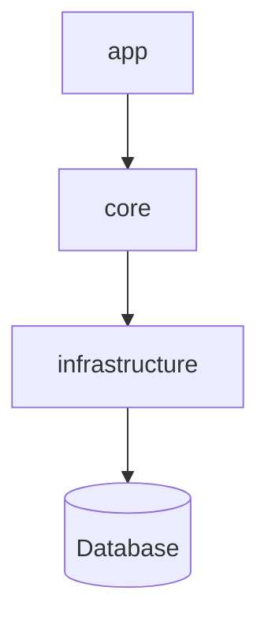

# Api Architecture

We are using a three layer architecture separating the api into the layers `app`, `core` and `infrastructure`.
Each of the layers consists of a NestJs module which is divided into further sub-folders. This way one can get a 
good overview of the application quickly. This division also allows us to easily test, extend and maintain the application.

## Layers



### app
This layer is the single point of communication with the user and contains the access points of the api. 
The controllers and the auth configurations needed to guard the communication reside here. 
As we are using the passport libraries the auth folder also contains the strategies and guards we need to implement the security.
The controllers are simple and don't contain any business logic. They just receive the data and immediately propagate it to the core services.

### core
This is the business/domain layer which contains our business logic. This layer is referenced by the
app layer and provides and manipulates the data according to our business rules. We also specify our
interfaces here which allows us to be able to easily test the application. Services are used to
establish communication between the app and core layers.

### infrastructure
This layer handles all the work needed to get the data from the database and keep the data up to date with the 
current model changes. The repositories are provided by TypeOrm and are not implemented by us. TypeOrm provides a set of standard
functionalities for CRUD operations in their repositories which are more than enough for what we need and therefore it does not make sense
to create custom implementations.

## Project folder structure

```
gipfeli-api/
├── src/
│   ├── app/
│   │   ├── auth/
│   │   │   ├── strategies
│   │   │   └── guards
│   │   └── controllers
│   ├── core/
│   │   ├── common
│   │   ├── dtos
│   │   ├── services
│   ├── infrastructure/
│   │   ├── config
│   │   ├── entities
│   │   └── migrations
│   └── main.ts
└── test
```
