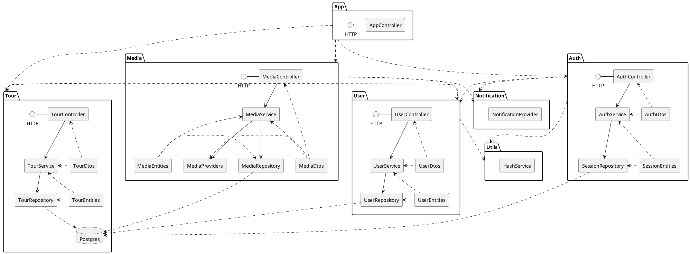

We are using the out-of-the-box architecture provided by NestJS which consists of a modular approach. Each domain gets
its own feature module which can then be imported by other modules (by default modules are singletons and thus can be
shared). Each NestJS application has at least one root module which is the starting point for NestJS to build the
internal data structure to resolve relationships between modules, providers and dependencies. Using the recommended
architecture gives us a scalable, testable ad loosely coupled application which is also easily maintainable. In
addition, it allows us to the CLI NestJS provides which makes creating new components (modules, services, controllers
etc.) easy and fast.

## Modules

Each module represents a domain or a task in our application and may consist of the following elements:

- DTOs
- Interfaces
- Types
- Controllers
- Services
- Validators
- Decorators
- Providers

There are also some more elements you can have in a module. Please refer to the official NestJS documentation for a
complete overview: [NestJS Documentation](https://docs.nestjs.com)

### Modules

#### App

The app module is the root module of the application. For nest.js, this is like the entrypoint module that exposes all
the modules (that need exposure) to the route creator. Its controller also has some convenience routes, e.g. for
exposing a `robots.txt` file.

#### Tour

This module represents the `Tour` domain object. It exposes CRUD routes for dealing with tours, which is handled by its
service. As such, it also needs the user module to attach a tour to a user.

#### User

The user module represents the `User` domain object and exposes CRUD routes for dealing with users. This module exposes
some minor routes, but in essence, it is only used by other modules. It is only dependent on the utils module for
hashing the user passwords.

#### Auth

This module handles all our authentication needs as well as session management. It implements various authentication
strategies for different endpoints and exposes them to be used in other modules. It is dependent on the user and
notification module, because the auth module handles things like login and user creation, which require both the users
as well as the possibility to dispatch notifications.

#### Media

The mediamodule handles all things related to user uploads. It has several providers which perform various tasks, like
storing it to a cloud storage or extracting GPS coordinates from images. It is dependent on the notification, user and
tour module for notifying administrators of clean up tasks and also attaching uploads to tours and users.

#### Notification

This module only exposes the internally used notification provider. All modules that need to create notifications may
import this module and get an environment-dependent notification provider (e.g. sendgrid, `console.log`).

#### Utils

For elements which do not have a domain per se (e.g. a service to hash passwords) we created a module that adds helpers
we need in different parts of the application.

### Other non-modules

Besides the mentioned modules, the project also relies upon a `config` directory which populates nest's `ConfigService`
with several namespaces. These configuration values are populated through environment variables and exposed via the
service wherever they are needed.

The `shared` directory consists of elements that are not part of a module, but shared across the whole application.
Currently, only our `SentryInterceptor` is placed there, which is used to intercept any error and log it to Sentry.

## TypeORM

Out-of-the-box, TypeORM uses the repository pattern which means that each entity has its own repository. The
repositories can be used by using TypeORM's generic repository which provides functionalities to query all entities or
execute CRUD operations. As we do not need custom queries at the moment we can use the generic repository which means
that there are no repository files listed in our modules.

### Migrations

The folder containing the migrations TypeORM will use to synchronize entity information to the database is not managed
inside the source-folder (src). Because the migration lifecycle is maintained by the TypeORM CLI they should not be a
part of source code.

To get more information on the recommended architecture using TypeORM and NestJS please refer to
the [NestJS documentation](https://docs.nestjs.com/techniques/database#database). For details on TypeORM please check
out [typeorm.io](https://typeorm.io/).

## Handling user uploaded media related to tours

Tours can have GPX files and/or images attached to them. These files are provided during the creation/editing process of
a tour. In order to provide users with a seamless user experience, the media handling is a bit more complex than just
uploading the files once the form is submitted. Since a user should be able to upload several files at once and also
submit a new tour without having to wait a long time (because he may also submit 20, 30 or more images as well as a GPX
file), media files are uploaded immediately once they are dropped in the corresponding dropzone in the frontend.

Backendwise, the following steps are performed (for brevity, only the case for an image is explained; however, it works
the same for a GPX file but with different endpoint):

1. The request (with an image) is POSTed to `media/upload-image`. After some basic validations (e.g. filetypes,
   filesize), the request is dispatched to the `MediaService`.
2. The `MediaService` uses the storage provider that is injected via nest's DI container to store the file. In our case,
   this is the `GoogleCloudStorageProvider`.
3. Once the provider succesfully returns the identifier for the uploaded file, the `MediaService` stores a new `Image`
   object in the database, consisting of the storage identifier, a UUID and the relation to the `User` who submitted the
   request. At this point, the relation to `Tour` is null, because we might not yet have an existing `Tour` object (e.g.
   in the case of adding a new tour).
4. The UUID and identifier of the newly stored `Image` entity is then returned as response to the intial POST request
   and stored in the frontend's current formstate.
5. Once the user submits the complete form, they only submit the UUIDs of the images they still have in their form. The
   request to create or update a `Tour` then synchronizes the `Tour` relationship between the image.

This approach has the following benefits:

* A user gets immediate feedback whether their files can be saved or not.
* A user can still upload files and, before they actually submit the whole `Tour`, can still decide to drop some
  files. If so, it's just the UUIDs that are not sent and no relation to a `Tour` on the previously updated file is
  made.
* The backend can easily see which files do not have a relation to a `Tour` and can be deleted from the CloudStorage;
  e.g. via a Cronjob that periodically checks for missing relations and asks CloudStorage to remove these files.

The only drawback is that we use storage that may not be needed (e.g. if a user drops several images into the form and
then does not save the tour). However, given that the storage is very cheap and we limit the file size to 2MB, this can
be neglected.

### Cleaning up

As mentioned above, not all uploaded and stored files may be linked to a tour. Furthermore, when a user deletes a tour,
the files are not immediately deleted, because this might take some time. Instead, the relation to the deleted `Tour`
is set to `NULL`. The same also holds true if a user is deleted - since their tours are deleted, the `Tour` relation on
all their files is set to `NULL` as well as the user relation.

In order to clean up, the backend has a special API path, `GET api/media/clean-up-media` that finds all media objects in
the database that either have

* no relation to a `User` (meaning the user is deleted) or
* no relation to a `Tour`(meaning the tour is deleted) **and** are older than 1 day (this is required because if a user
  is in the process of uploading a file, it may not yet have a relation to a tour, but it should not yet be deleted).
 
Objects that fulfill this criteria are then deleted from the storage and the database and an email with clean up
statistics is sent to the defined administrators.

This endpoint is (weakly) protected by a simple bearer token that is defined as an environment variable. This is
sufficient (even-though insecure) because this endpoint does not expose anything sensitive. Furthermore, the token is
chosen to be a long, randomized string and as SSL connections are enforced, the Authorization header is encrypted.

In staging and production, this endpoint is triggered via a Cloud Scheduler task and runs once daily at 4 o'clock in the
morning.