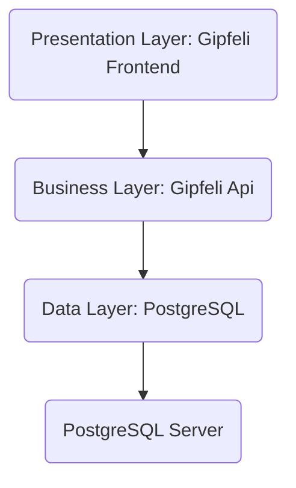

# Architecture Overview

We are using a three tier architecture consisting of a presentation layer (statically-built React Application), 
business layer (NestJs Application) and a data layer (PostgreSql database) for persistence. 
Each of the layers is hosted on a different Google Service (for details see [Infrastructure](../infrastructure/basics))
and has it's own update cycle.

