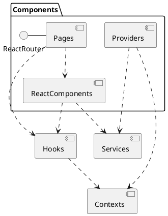

Since we're using React, there is no clear-cut MVC structure such as with Angular. In recent version, React fully
embraces the functional paradigm in
recommending [functional components](https://reactjs.org/docs/components-and-props.html#function-and-class-components)
and using the powerful [hooks](https://reactjs.org/docs/hooks-intro.html). However, we still decided to have some kind
of structure to increase readability and maintainability.

:::info Where is next.js!?

Initially, the project started with [next.js](https://nextjs.org/). However, we came to realize that it was the wrong
tool for our project and added unnecessary overhead. The decision was taken in agreement with Tobias
during [development meeting 4](/meeting-notes/development-meeting-4). The main work was done
in [merge request #36](https://github.com/gipfeli-io/gipfeli-frontend/pull/36). For those interested, the last version
using next.js can be found in the
[`deprecated/nextjs-base`](https://github.com/gipfeli-io/gipfeli-frontend/tree/deprecated/nextjs-base) branch.

:::



The above components are the essential building blocks of our frontend.

## General

A React app consists of a tree of components. The actual components are rendered depending on the current state of the
application. In order to be able to handle routing, we are using the  [ReactRouter](https://reactrouter.com/) library.
This application consists of components that are used to define which components should be rendered when a user accesses
a given page. As such, this library can be seen as something like the entry point to our frontend.

Since ReactRouter has very powerful nesting features, it also allows to define layouts that span across multiple pages
using its `<Outlet />` component.

:::tip Example

As an example, all our routes are nested within a `<Route path="/" element={<MainLayout/>}>` component, which uses
a `<MainLayout />` component. This component defines some global stylings that apply for all pages in our app.
:::

## Components

Components are React components and can be divided in 3 subgroups.

### Pages

`Pages` are special kinds of components that define a page that is accessible via a URL through ReactRouter. A `Page`
handles the choice of components for its functionality as well as data fetching on a global (read: page-wide) scale. It
uses various `ReactComponents`, both custom as well as visual ones from the Material UI library.

:::tip Example

The following code renders the `<Login />` page component, nested inside its `<AuthPageLayout />` and maps to the path "
host.name/login".

```jsx
<Route path="/" element={<AuthPageLayout/>}>
    <Route path="login" element={<Login/>}/>
</Route>
```

:::

### ReactComponents

React apps are composed of subcomponents which serve display purposes and functionalities. An example is
a `<TourForm />` component which serves as the host component for realizing our tour form. It is composed of several
subcomponents and has different functions.

They can access `Services` when they need to fetch data from sources such as an API or local storage, and they may also
use `Hooks` (see below).

### Providers

These are special components since they realize
a [ContextProvider](https://reactjs.org/docs/context.html#contextprovider). Their purpose is to wrap its children inside
a context that provides the children with global functionalities, removing the need to pass down functional properties
in a deeply nested component tree. See below for more information.

As such, they can also use `Services` if they require things from data sources.

## Hooks

These are a recent React feature that allows to use things that were previously only usable in class components, such as
state. Besides the [official hooks](https://reactjs.org/docs/hooks-reference.html), we also added custom hooks, which
can be used by our `Components`.

They can use `Services` and also reference `Contexts`

## Services

These are standard services that are used to fetch data from any kind of source - localstorage, API, etc.

## Context

A context defines an interface that is provided by a provider and consumed by a consumer. See below.

## Hooks, Context and Providers explained

We use these features to implement large-scale contexts. We also have smaller contexts (e.g. a `MapContext`) that are
used within a contained environment, such as a group of components (e.g. the `Map` component). These work in a similar
way, but can be simplified without hooks and external providers.

We have the following contexts:

* `ThemeContext`: Used to retrieve, set and store the user's preference for darkmode or lightmode
* `AuthenticationContext`: Used to store the user's login state
* `NotificationContext`: Used to display notifications that can be triggered by any component in the tree

The way we implemented these features is as follows:

* The `Context` defines its interface, specifying which props it has (which can be values or functions)
* The `Provider` is an actual implementation of a `Context` which returns a `ContextProvider` with the interface
  implementation. It wraps around all the child components it gets passed as props.
* The `Hook` basically just returns `useContext` and can be used by components requiring the `Context`.

Using this pattern, the components do not need to know anything about the implementation of the context, since that is
delegated fully to the `Provider`. Just using the `Hook` is enough to access the `Context`.