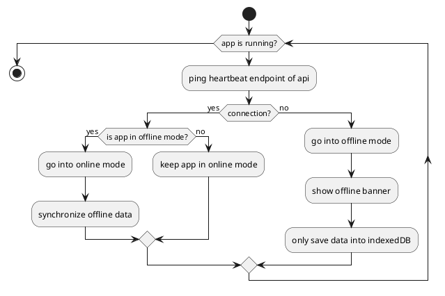

## PWA basics
A PWA (Progressive Web App) is a simple way to give a user the feel of a native app without writing a native app. The application is installable on 
a device (can also be a laptop) and can be used accessing an icon on the home screen/desktop. With the help of a manifest file we can configure the 
look of the app during startup, how it is displayed on the device and the app icon. There are some limitations like accessing the hardware (e.g. storage)
of a device but overall the app feels like a native app.

## Static files

### Service Worker
We are using workbox from Google to work with the service worker. This is the recommended way by React.
When creating a pwa with react-create-app it is pre-installed and pre-configured to precache all items in the manifest.json (ReactJS will inject some additional assets there. So not everything needs
to be specified manually).

## Dynamic data

### Storage
The service worker is perfect for caching static data like css files or icons. But for dynamic data we need more control and a way to easily
and comfortably manipulate data. This is why we use IndexedDb to store our dynamic data when the user is offline. This approach provides us with 
the possibility to store our objects without needing to transform them e.g. into a JSON string. The data is indexed and therefore can be queried quite
easily. As IndexedDB is pretty tedious to work with and promise based we are using a wrapper to simplify our work. 
We decided to use [Dexie.js](https://dexie.org/) as it can be used with async/await and provides a nice and easy to use wrapper for the IndexedDB api.

:::info
Why not use local storage for storing the data? 
Local storage is synchronous and therefore blocks the main thread. It is also limited in space and only lets us save strings which makes
working with complex data structures very uncomfortable.
:::

## Implementation

### What is accessible offline?
We decided to only make the tours usable offline. If an administrator wants to modify users they have to do it while online. 
We decided to allow all the CRUD functionality for tours but to restrict the tour form. As it is nearly impossible to be able to use 
the map offline due to the amount of (tile) data we need for this we decided to hide the map when the user is offline. We also decided that the 
user won't be able to upload images while using the offline mode as with the current solution it won't work (we also don't want to
duplicate the code to extract GPS data from an image). So essentially what is possible to do while using the offline mode:

- Create a new tour, set a title and add the tour documentation
- Edit an existing tour (title and description)
- Remove an existing tour
- View an existing tour (title and description)

### Resetting
As there sometimes can be situations where the indexedDB is in a non-recoverable state we added the possibility to reset the database.
The functionality will remove the existing database structure and all it's data and re-add a freshly initialised database.

### Difficulties
#### Flow
The main difficulties are saving and retrieving locally stored data at the right time. As we essentially work with two different
databases that we need to keep in sync we had to analyse each flow and think about the way we want to handle offline and remote data. Our first 
draft had the following workflow:



While testing we realised that this is not the optimal way to handle the offline functionality. The constant pinging of the backend was unfortunate
and always switching between offline/online mode (even with auto sync) would result in sometimes unpredicted behaviour (especially in error cases). 
So we brainstormed some time and then implemented the following workflow:

```plantuml Current workflow with manual switch between offline and online mode
@startuml

start
:user clicks on any CRUD operation;
:send request to backend;
note left 
  For the detail and create view 
  we poll the heartbeat endpoint on
  view start to check for connection.
  For Delete and Edit we send the data
  to the api and check the response
end note
if(request returns 500 - fetch failed?) then (yes)
:show banner with button to go into offline mode;
if(user goes into offline mode?) then (yes)
:show offline banner;
:save data locally;
 repeat
    :ping heartbeat endpoint;
    if(is online?) then (yes)
      :show go online banner and button;
      if(user goes online) then (yes)
      :take app online;
      :sync offline data;
      else (no)
      :keep app in offline mode;
      endif
      break;
    else (no)
    endif
  repeat while ( 500 - fetch failed?)
else (no)
:app is not usable until connection is back;
endif
else (no)
:app keeps running in online mode;
endif
stop

@enduml

```

Now the user can decide whether they want to use the app in offline mode or wait until they are online again. This makes it clearer for the user
what to expect from the app. We could also clear up a lot of otherwise pretty complicated code parts and make the app easier to maintain and extend.

#### Browser support
Unfortunately there are some browser quirks we have to work with that are not solvable just yet. For example when using Firefox in private mode
it is not possible to use indexedDB as they restrict it. There is also the problem with iOS devices because the only way to install the application
is using Safari. Firefox and Chrome on iOS Mobile don't allow installing PWAs.

### Synchronize offline data with database
When the user decides to go into online mode again we will automatically synchronize all of their data. The only thing we cannot synchronize right 
away are tours that were created while in offline mode. Those tour lack the information about the waypoints which are mandatory for each tour. We 
mark the tour with a batch and as soon as the user is ready they can add the missing information and submit the tour to our server.

## Articles used

- [Offline Post with usage of dexie](https://www.dotnetpro.de/core/mobile/offline-mitgedacht-1659518.html)
- [Mozilla Client Storage](https://developer.mozilla.org/en-US/docs/Learn/JavaScript/Client-side_web_APIs/Client-side_storage#offline_asset_storage)
- [web.dev - Storage for the web](https://web.dev/storage-for-the-web/)

### Google Workbox
- [Caching Strategies](https://developer.chrome.com/docs/workbox/caching-strategies-overview/)
- [Workbox Routing](https://developer.chrome.com/docs/workbox/modules/workbox-routing/)