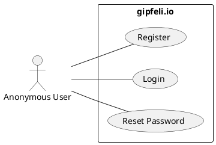
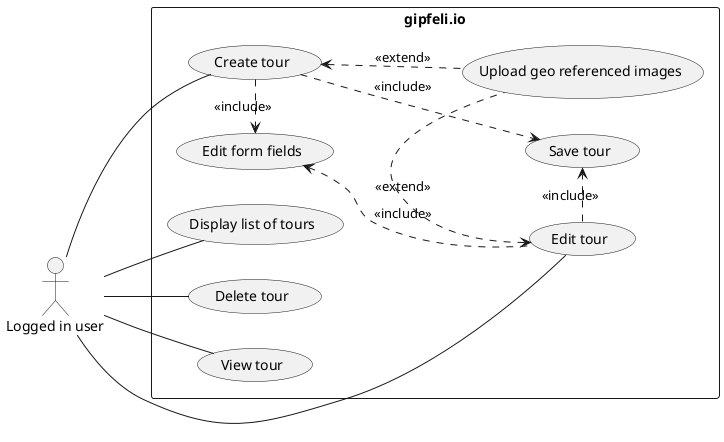

### User self service

```plantuml User sign up
@startuml
left to right direction
actor "Anonymous User" as au
rectangle gipfeli.io {
  usecase "Register" as UC1
  usecase "Login" as UC2
  usecase "Reset Password" as UC3
}
au -- UC1
au -- UC2
au -- UC3
@enduml
```

### User actions for logged in users

```plantuml Tour administration
@startuml
left to right direction
actor "Logged in user" as lu
rectangle gipfeli.io {
  usecase "Display list of tours" as UC1
  usecase "Edit tour" as UC2
  usecase "Delete tour" as UC3
  usecase "View tour" as UC4
  usecase "Create tour" as UC5
  usecase "Edit form fields" as UC6
  usecase "Upload geo referenced images" as UC7
  usecase "Save tour" as UC8
  
  UC2 -up.> UC6 : <<include>>
  UC5 .> UC6 : <<include>>
  UC2 .> UC8 : <<include>>
  UC5 .> UC8 : <<include>>
  UC2 <. UC7 : <<extend>>
  UC5 <. UC7 : <<extend>>
}
lu -- UC1
lu -- UC2
lu -- UC3
lu -- UC4
lu -- UC5
@enduml
```
[TODO: Detail description of Use Cases]                      |