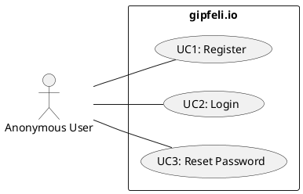
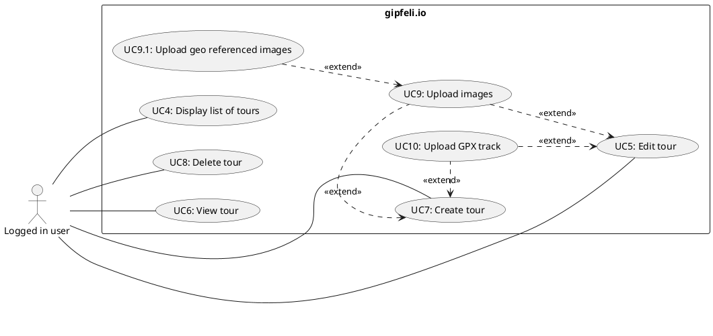
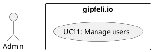

## User self service

### UC1: Register

* **Actor:** Anonymous user
* **Preconditions:** *none*
* **Flow of events:**
    1. User enters the register page
    2. User fills in all required information
    3. User hits submit, which dispatches an email for verification
    4. User clicks the email verification link
    5. User is logged in and activated
* **Postconditions**: User has an activated account.
* **Possible rainy day scenarios**:
    * User already has an account - same email address can only be used once.
    * User tries to login without verification link clicked - error message shown.

### UC2: Login

* **Actor:** Registered user
* **Preconditions:** User has a verified account
* **Flow of events:**
    1. User enters the login page
    2. User fills in email and password
    3. User hits submit
    4. User is logged in
* **Postconditions**: User is logged in.
* **Possible rainy day scenarios**:
    * User has no account - error message shown.
    * User tries to login without verification link clicked - error message shown.

### UC3: Reset password (optional)

* **Actor:** Registered user
* **Preconditions:** User has a verified account
* **Flow of events:**
    1. User enters the reset password page
    2. User fills in email
    3. User hits submit, an email is dispatched with a reset link
    4. User clicks the reset link
    5. User enters their new password and confirms it, hits submit
    6. User is logged in
* **Postconditions**: User is logged in and the new password is set
* **Possible rainy day scenarios**:
    * User has no account - error message shown.
    * User tries to reset without verification link clicked - error message shown.

## User actions for logged in users

### UC4: Display list of tours

* **Actor:** Registered user
* **Preconditions:** User has a verified account, user is logged in
* **Flow of events:**
    1. User enters overview pages
    2. User sees a list of previously entered tours
* **Postconditions**: *none*
* **Possible rainy day scenarios**:
    * User has no tours - message is shown.

### UC5: Edit tour

* **Actor:** Registered user
* **Preconditions:** User has a verified account, user is logged in, user has an existing tour
* **Flow of events:**
    1. User enters overview page
    2. User enters detail page and clicks edit *or* directly enters edit page
    3. User sees a prepopulated edit form with the tour details
    4. User edits (some) fields
    5. User hits save
    6. Tour is saved and user sees the newly persisted state
* **Postconditions**: Tour is edited.
* **Possible rainy day scenarios**:
    * User has no tours - edit screen is not accessible.

### UC6: View tour

* **Actor:** Registered user
* **Preconditions:** User has a verified account, user is logged in, user has an existing tour
* **Flow of events:**
    1. User enters overview page
    2. User enters detail page
    3. User sees a prepopulated detail page
* **Postconditions**: *none*
* **Possible rainy day scenarios**:
    * User has no tours - detail screen is not accessible.
    * User accesses tour that does not exists - error message shown.
    * User accesses tour that does not belong to them - error message shown.

### UC7: Create tour

* **Actor:** Registered user
* **Preconditions:** User has a verified account, user is logged in
* **Flow of events:**
    1. User enters overview page
    2. User enters create page
    3. User sees an empty form
    4. User enters all required information and hits submit
    5. User is taken to the prepopulated detail page with their new tour.
* **Postconditions**: Tour is created
* **Possible rainy day scenarios**:
    * *none*

### UC8: Delete tour

* **Actor:** Registered user
* **Preconditions:** User has a verified account, user is logged in, user has an existing tour
* **Flow of events:**
    1. User enters overview page
    2. User enters detail page and clicks delete *or* directly deletes from overview page
    3. User confirms deletion
    4. Success message is shown
* **Postconditions**: Tour is deleted.
* **Possible rainy day scenarios**:
    * User does not confirm deletion - tour is not deleted.

### UC9: Upload images

* **Actor:** Registered user
* **Preconditions:** User has a verified account, user is logged in, user has an existing tour, user is either creating
  or editing a tour
* **Flow of events:**
    1. User uploads images
    2. Images are checked for file size and mimetype and saved to object storage
    3. On detail pages, the images are shown in form of a gallery and can be viewed
* **Postconditions**: Photos are uploaded and attached to tour
* **Possible rainy day scenarios**:
    * Invalid file size - error message shown.
    * Invalid file type - error message shown.

### UC9.1: Upload geo referenced images

*Note: This is an extension of [UC9](#uc9-upload-images) and is automatically applied if the photos are geo-referenced.
The user does not have to take any action. UC9 applies here as well.*

* **Actor:** Registered user
* **Preconditions:** User has a verified account, user is logged in, user has an existing tour, user is either creating
  or editing a tour
* **Flow of events:**
    1. User uploads images
    2. Images are checked for filesize, mimetypes and coordinates and saved accordingly
    3. On detail pages, the images are shown on the map
* **Postconditions**: Photos are uploaded, photos are georeferenced on the map and attached to the tour
* **Possible rainy day scenarios**:
    * Invalid georeference - only photo is saved.

### UC10: Upload GPX track (optional)

* **Actor:** Registered user
* **Preconditions:** User has a verified account, user is logged in, user has an existing tour, user is either creating
  or editing a tour
* **Flow of events:**
    1. User uploads GPX track file
    2. GPX track file is checked for file size and mimetype and saved to object storage
    3. On detail pages, the GPX track is shown on the map and the file may be downloaded
* **Postconditions**: GPX track is uploaded and shown on the map and attached to the tour
* **Possible rainy day scenarios**:
  * Invalid file size - error message shown.
  * Invalid file type - error message shown.
  * Invalid GPX file - map does still render.

## Administration

### UC11: Manage users

* **Actor:** Admin user
* **Preconditions:** User is logged in, user is admin
* **Flow of events:**
    1. Admin sees list of users
    2. Admin can delete users after confirmation
* **Postconditions**: User is deleted
* **Possible rainy day scenarios**:
    * *none*
