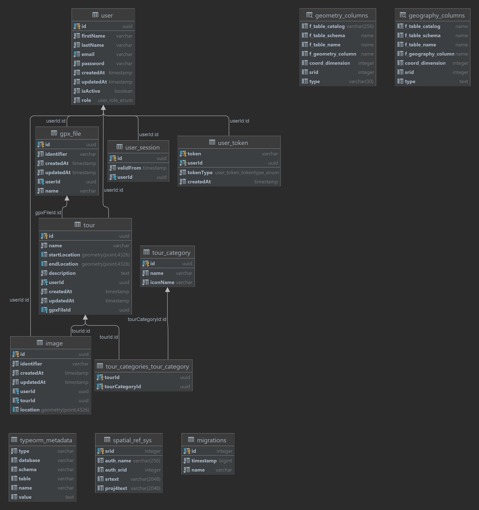

The data model is generated by [TypeORM](https://typeorm.io/). TypeORM generates the necessary data structure by looking
at the defined classes and relationships, using decorators and other features to transform TypeScript classes into
database representations. As an ORM, we do not deal with SQL entities directly, but rather with Entities that TypeORM
maps to database entities.

The generated database schema looks as follows (explanation of tables below):

[(enlarge image)](../../static/img/docs/domain/datamodel.png)

## `user`

Contains all the `user` data (including a hashed password).

## `user_session`

Contains all sessions a current `user` has (
see [authentication & session management](../architecture/security/authentication-session-management.md)).
The `validFrom` attribute is set to when the session is created or refreshed and used to verify a session.

## `user_token`

Contains all tokens for a `user`. Currently, a token is used for either account activation or password reset. The token
itself is just the hashed representation, its cleartext value is only used during token creation and sent to the user
via email.

## `tour`

The actual `tour` documentation object. Contains PostGIS geometry objects for start and end location as well as the
foreign keys to its owning `user` and, if present, its associated `gpx_file`.

## `tour_category`

Contains all available categories a user can use to classify their tour. The `iconName` attribute is an implementation
detail for mapping tours to their icon in the frontend.

## `tour_categories_tour_category`

Auto-generated by TypeORM, represents the many-to-many relationship that `tours` and `tour_categories`.

## `image`

Contains the data associated with an uploaded `image`. Notice the location attribute (another PostGIS geometry object),
specifying (if available) the `image`'s geo-referenced location, as well as the `identifier`, referring to the name in
our object storage.

## `gpx_file`

Similar to `image`, contains data associated with an uploaded `gpx_file`. Here, also the original filename is stored
since it is displayed in the frontend for better book-keeping.

## TypeORM Tables

TypeORM also adds two tables which it needs to work: `typeorm_metadata` and `migrations`. The later one keeps track of
all migrations that are currently applied and is used to determine whether and which migrations need to be run when
executing `npm run typeorm:migrate`.

## System tables

Apart from the above tables which are implemented by our application or TypeORM, several system tables exist.

### `geometry_columns` and `geography_columns`

These tables are used by PostGIS to keep track of geometry and geography columns in other tables.

### `spatial_ref_sys`

Table containing all supported spatial reference systems available for PostGIS to use on its geometries.