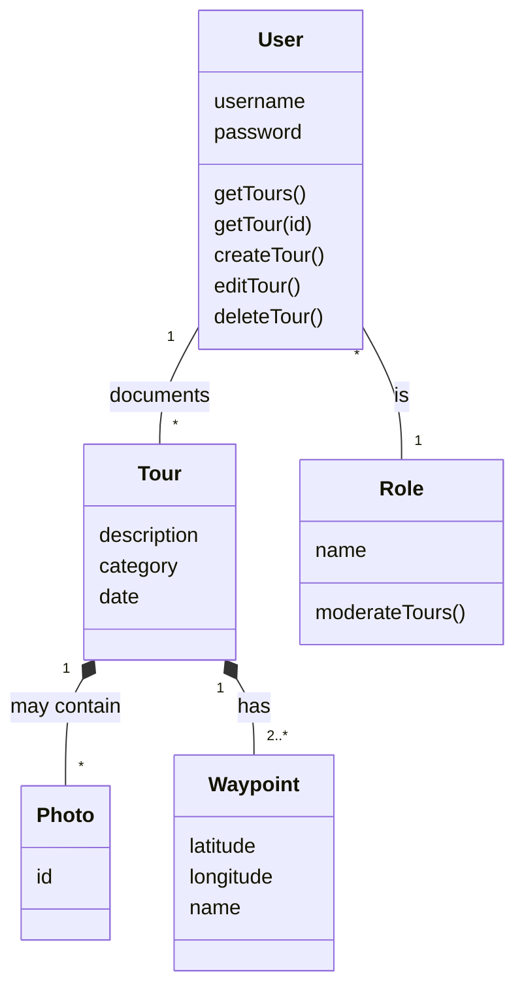

This section shows the domain model for the gipfeli.io app and explains its components.

## `User`

This is the basic entity that interacts with the application. It has a `username` and a `password` used for
authenticating and referencing any given user. The user performs the CRUD operations for the `Tour` objects they
document. Additionally, each user has at least one `Role` assigned that governs what they are able to do.

## `Role`

Since the application also needs some kind of moderation, each `User` has exactly one `Role` attached. The
default `Role` is identifying any `User` as normal user, allowing them to perform the aforementioned actions on
their `Tour` objects. Moderating users have the role `administrator` which gives them the ability to `moderateTours()`,
meaning that they can e.g. delete `Tour` objects from other users.

## `Tour`

This is the main entity that the website is about and represents a `Tour` that any given `User` has documented. It has
several attributes relating to the description of the `Tour` itself and is always associated with exactly one `User`. It
may also contain one or more `Photo` objects and always consists of at least 2 `Waypoint` objects (start/endpoint).

## `Photo`

A `Photo` can be added to any `Tour`. When the `Tour` object is deleted, the associated `Photo` objects are removed as
well - they cannot exist without a `Tour`.

## `Waypoint`

A `Tour` has at least 2 `Waypoint` objects. A `Waypoint` defines any geographical location by a pair of coordinates.
When the `Tour` object is deleted, the associated `Waypoint` objects are removed as well - they cannot exist without
a `Tour`.

