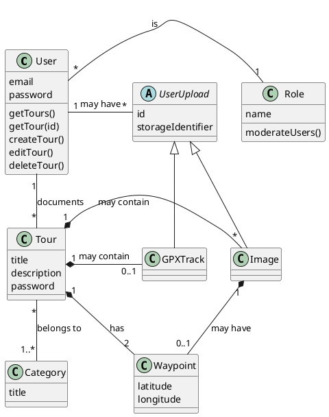

This section shows the domain model for the gipfeli.io app and explains its components.

:::info
Note that this does not represent the data model directly, but rather the abstract domain. This means that not all
classes are represented as designed below or have the exact methods - for example, the `Role` can also be expressed as
an Enum field on the `User` table itself. Furthermore, more attributes might exist, which are not relevant for the
domain model here. For the exact data model, see [its documentation](./data-model).

Since we're also providing an
offline functionality, some of the attributes might not be present at all times. If you for example create a tour while
in an offline state, the `Tour` entity might temporarily not have any waypoints, because they can only be added later on
when the tour is synchronized.
:::

## `User`

This is the basic entity that interacts with the application. It has a `username` and a `password` used for
authenticating and referencing any given user. The user performs the CRUD operations for the `Tour` objects they
document. Additionally, each user has at least one `Role` assigned that governs what they are able to do. Lastly,
a `User` might have some `UserUploads` which are used within a `Tour`.

## `Role`

Since the application also needs some kind of moderation, each `User` has exactly one `Role` attached. The
default `Role` is identifying any `User` as normal user, allowing them to use the application for managing their
`Tours`. Moderating users have the role `administrator` which gives them the ability to `moderateUsers`,
meaning that they can e.g. delete `Users`.

## `Tour`

This is the main entity that the website is about and represents a `Tour` that any given `User` has documented. It has
several attributes relating to the description of the `Tour` itself and is always associated with exactly one `User` and
deleted when its owning `User` is removed. It
may also contain one or more `Image` objects and/or exactly 1 `GPXTrack`. It always consists of 2 `Waypoint` objects (
start/endpoint).

## `TourCategory`

Each `Tour` is assigned to at least one `TourCategory`, though a `Tour` might also have several `TourCategories` (e.g.
alpine hike + climbing). `TourCategories` are managed application-wide and can be used by all `Users`.

## `UserUpload`

This is an abstract entity that refers to any upload a given `User` has performed. It has an ID which uniquely
identifies any `UserUpload`. Any `UserUpload` is removed if its owning user is removed. It also needs to keep track of
how it is identified in the storage used in the application (e.g. the filename within a given storage).

## `Image`

A `Image` is a `UserUpload` and can be added to any `Tour`. When the `Tour` object is deleted, the associated `Image`
objects are removed as
well - they cannot exist without a `Tour`. An `Image` might also have a `Waypoint` when it has GPS tags enabled during
its caption, allowing its location to be displayed on the map.

## `GPXTrack`

A `GPXTrack` is a `UserUpload` and can be added to any `Tour`. When the `Tour` object is deleted, the
associated `GPXTrack`
object is removed as
well - it cannot exist without a `Tour`.

## `Waypoint`

A `Waypoint` defines any geographical location by a pair of coordinates.

