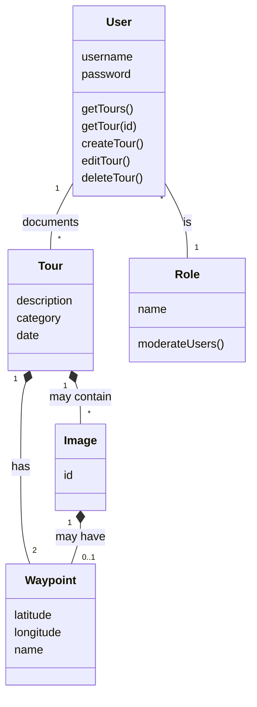

This section shows the domain model for the gipfeli.io app and explains its components.

:::info
Note that this does not represent the datamodel directly, but rather the abstract domain. Since we're also providing an
offline functionality, some of the attributes might not be present at all times. If you for example create a tour while
in an offline state, the `Tour` entity might temporarily not have any waypoints, because they can only be added later on
when the tour is synchronized.
:::

## `User`

This is the basic entity that interacts with the application. It has a `username` and a `password` used for
authenticating and referencing any given user. The user performs the CRUD operations for the `Tour` objects they
document. Additionally, each user has at least one `Role` assigned that governs what they are able to do.

## `Role`

Since the application also needs some kind of moderation, each `User` has exactly one `Role` attached. The
default `Role` is identifying any `User` as normal user, allowing them to perform the aforementioned actions on
their `Tour` objects. Moderating users have the role `administrator` which gives them the ability to `moderateUsers`,
meaning that they can e.g. delete `Users`.

## `Tour`

This is the main entity that the website is about and represents a `Tour` that any given `User` has documented. It has
several attributes relating to the description of the `Tour` itself and is always associated with exactly one `User`. It
may also contain one or more `Image` objects and always consists of 2 `Waypoint` objects (start/endpoint).

## `Image`

A `Image` can be added to any `Tour`. When the `Tour` object is deleted, the associated `Image` objects are removed as
well - they cannot exist without a `Tour`. An `Image` might also have a `Waypoint` when it has GPS tags enabled during
its caption.

## `Waypoint`

A `Waypoint` defines any geographical location by a pair of coordinates.

